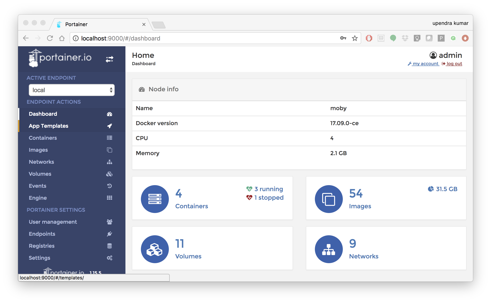

**Introduction to Docker**
--------------------------

|docker|

1. Prerequisites
================

There are no specific skills needed for this tutorial beyond a basic comfort with the command line and using a text editor. Prior experience in developing web applications will be helpful but is not required.

2. Docker Installation
======================

Getting all the tooling setup on your computer can be a daunting task, but not with Docker. Getting Docker up and running on your favorite OS (Mac/Windows/Linux) is very easy.

The getting started guide on Docker has detailed instructions for setting up Docker on `Mac <https://docs.docker.com/docker-for-mac/install/>`_/`Windows <https://docs.docker.com/docker-for-windows/install/>`_/`Linux <https://docs.docker.com/install/linux/docker-ce/ubuntu/>`_.

.. Note:: 

	If you're using Docker for Windows make sure you have `shared your drive <https://docs.docker.com/docker-for-windows/#shared-drives>`_. 
	
	If you're using an older version of Windows or MacOS you may need to use `Docker Machine <https://docs.docker.com/machine/overview/>`_ instead. 
	
	All commands work in either bash or Powershell on Windows.

.. Note::

	Depending on how you've installed Docker on your system, you might see a ``permission denied`` error after running the above command. If you're on Linux, you may need to prefix your Docker commands with sudo. Alternatively to run docker command without sudo, you need to add your user (who has root privileges) to docker group. 
	For this run: 

	Create the docker group::

		$ sudo groupadd docker
	
	Add your user to the docker group::

		$ sudo usermod -aG docker $USER

	Log out and log back in so that your group membership is re-evaluated

2.1 Testing Docker installation
~~~~~~~~~~~~~~~~~~~~~~~~~~~~~~~

Once you are done installing Docker, test your Docker installation by running the following command to make sure you are using version 1.13 or higher:

.. code-block:: bash

	$ docker --version
	Docker version 17.09.0-ce, build afdb6d4

When run without ``--version`` you should see a whole bunch of lines showing the different options available with ``docker``. Alternatively you can test your installation by running the following:

.. code-block:: bash

	$ docker run hello-world
	Unable to find image 'hello-world:latest' locally
	latest: Pulling from library/hello-world
	03f4658f8b78: Pull complete
	a3ed95caeb02: Pull complete
	Digest: sha256:8be990ef2aeb16dbcb9271ddfe2610fa6658d13f6dfb8bc72074cc1ca36966a7
	Status: Downloaded newer image for hello-world:latest

	Hello from Docker.
	This message shows that your installation appears to be working correctly.

	To generate this message, Docker took the following steps:
	 1. The Docker client contacted the Docker daemon.
	 2. The Docker daemon pulled the "hello-world" image from the Docker Hub.
	 3. The Docker daemon created a new container from that image which runs the
	    executable that produces the output you are currently reading.
	 4. The Docker daemon streamed that output to the Docker client, which sent it
	    to your terminal.
	.......

3. Running Docker containers from prebuilt images
=================================================

Now that you have everything setup, it's time to get our hands dirty. In this section, you are going to run a container from `Alpine Linux <http://www.alpinelinux.org/>`_ (a lightweight linux distribution) image on your system and get a taste of the ``docker run`` command.

But wait, what exactly is a container and image?

**Containers** - Running instances of Docker images — containers run the actual applications. A container includes an application and all of its dependencies. It shares the kernel with other containers, and runs as an isolated process in user space on the host OS. 

**Images** - The file system and configuration of our application which are used to create containers. To find out more about a Docker image, run ``docker inspect hello-world``. In the demo above, you could have used the ``docker pull`` command to download the ``hello-world`` image. However when you executed the command ``docker run hello-world``, it also did a ``docker pull`` behind the scenes to download the ``hello-world`` image with ``latest`` tag (we will learn more about tags little later).

Now that we know what a container and image is, let's run the following command in our terminal:

.. code-block:: bash

	$ docker run alpine ls -l
	total 52
	drwxr-xr-x    2 root     root          4096 Dec 26  2016 bin
	drwxr-xr-x    5 root     root           340 Jan 28 09:52 dev
	drwxr-xr-x   14 root     root          4096 Jan 28 09:52 etc
	drwxr-xr-x    2 root     root          4096 Dec 26  2016 home
	drwxr-xr-x    5 root     root          4096 Dec 26  2016 lib
	drwxr-xr-x    5 root     root          4096 Dec 26  2016 media
	........

Similar to ``docker run hello-world`` command in the demo above, ``docker run alpine ls -l`` command fetches the ``alpine:latest`` image from the Docker registry first, saves it in our system and then runs a container from that saved image. 

When you run ``docker run alpine``, you provided a command ``ls -l``, so Docker started the command specified and you saw the listing

You can use the ``docker images`` command to see a list of all images on your system

.. code-block:: bash

	$ docker images
	REPOSITORY              TAG                 IMAGE ID            CREATED             VIRTUAL SIZE
	alpine                 	latest              c51f86c28340        4 weeks ago         1.109 MB
	hello-world             latest              690ed74de00f        5 months ago        960 B

Let's try something more exciting.

.. code-block:: bash

	$ docker run alpine whoami
	root

OK, that's some actual output. In this case, the Docker client dutifully ran the ``whoami`` command in our ``alpine`` container and then exited it. If you've noticed, all of that happened pretty quickly. Imagine booting up a virtual machine, running a command and then killing it. Now you know why they say containers are fast!

Try another command.

.. code-block:: bash

	$ docker run alpine sh

Wait, nothing happened! Is that a bug? Well, no. These interactive shells will exit after running any scripted commands such as ``sh``, unless they are run in an interactive terminal - so for this example to not exit, you need to ``docker run -it alpine sh``. You are now inside the container shell and you can try out a few commands like ``ls -l``, ``uname -a`` and others. 

Before doing that, now it's time to see the ``docker ps`` command which shows you all containers that are currently running.

.. code-block:: bash

	$ docker ps
	CONTAINER ID        IMAGE               COMMAND             CREATED             STATUS              PORTS               NAMES

Since no containers are running, you see a blank line. Let's try a more useful variant: ``docker ps -a``

.. code-block:: bash

	$ docker ps -a
	CONTAINER ID        IMAGE               COMMAND                  CREATED             STATUS                      PORTS               NAMES
	36171a5da744        alpine              "/bin/sh"                5 minutes ago       Exited (0) 2 minutes ago                        fervent_newton
	a6a9d46d0b2f        alpine             "echo 'hello from alp"    6 minutes ago       Exited (0) 6 minutes ago                        lonely_kilby
	ff0a5c3750b9        alpine             "ls -l"                   8 minutes ago       Exited (0) 8 minutes ago                        elated_ramanujan
	c317d0a9e3d2        hello-world         "/hello"                 34 seconds ago      Exited (0) 12 minutes ago                       stupefied_mcclintock

What you see above is a list of all containers that you ran. Notice that the STATUS column shows that these containers exited a few minutes ago. 

If you want to run scripted commands such as ``sh``, they should be run in an interactive terminal. In addition, interactive terminal allows you to run more than one command in a container. Let's try that now:

.. code-block:: bash

	$ docker run -it alpine sh
	/ # ls
	bin    dev    etc    home   lib    media  mnt    proc   root   run    sbin   srv    sys    tmp    usr    var
	/ # uname -a
	Linux de4bbc3eeaec 4.9.49-moby #1 SMP Wed Sep 27 23:17:17 UTC 2017 x86_64 Linux

Running the ``run`` command with the ``-it`` flags attaches us to an interactive ``tty`` in the container. Now you can run as many commands in the container as you want. Take some time to run your favorite commands.

Exit out of the container by giving the ``exit`` command.

.. code-block:: bash

	/ # exit

.. Note::

	If you type ``exit`` your **container** will exit and is no longer active. To check that, try the following::

		$ docker ps -l
		CONTAINER ID        IMAGE                 COMMAND                  CREATED             STATUS                          PORTS                    NAMES
		de4bbc3eeaec        alpine                "/bin/sh"                3 minutes ago       Exited (0) About a minute ago                            pensive_leavitt

	If you want to keep the container active, then you can use keys ``ctrl +p, ctrl +q``. To make sure that it is not exited run the same ``docker ps -a`` command again::

		$ docker ps -l
		CONTAINER ID        IMAGE                 COMMAND                  CREATED             STATUS                         PORTS                    NAMES
		0db38ea51a48        alpine                "sh"                     3 minutes ago       Up 3 minutes                                            elastic_lewin

	Now if you want to get back into that container, then you can type ``docker start -ai <container id>``. This way you can save your container's content::

		$ docker start -ai 0db38ea51a48

4. Building custom Docker images
================================

4.1 Using docker commit (not recommended)
~~~~~~~~~~~~~~~~~~~~~~~~~~~~~~~~~~~~~~~~~

As we saw in the Docker introduction, the general Docker workflow is:

- start a container based on an image in a known state
- add things to the filesystem, such as packages, codebases, libraries, files, or anything else
- commit the changes as layers to make a new image

Let's follow this workflow to built a custom image. Instead of `alpine` this time we will use `ubuntu` linux image to install some interesting packages

As before first either pull the `ubuntu` docker image or you can just `docker run -it ubuntu` to pull and run the container interactively

.. code-block :: bash

	$ docker run -it ubuntu:16.04
	Unable to find image 'ubuntu:16.04' locally
	16.04: Pulling from library/ubuntu
	Digest: sha256:9ee3b83bcaa383e5e3b657f042f4034c92cdd50c03f73166c145c9ceaea9ba7c
	Status: Downloaded newer image for ubuntu:16.04
	root@7f989e4174aa:/#

Let's install two packages `fortune` and `cowsay` inside the container. But before that it's alway good idea to update the packages that are already existing in the ubuntu.

.. code-block :: bash

	root@7f989e4174aa:/# apt-get update
	root@7f989e4174aa:/# apt-get install -y fortune cowsay

Now exit the container and run `docker ps -a` to check to see if the status of the container (which is exit in this case)

.. code-block :: bash

	 root@7f989e4174aa:/# exit

Go ahead and commit the changes and create a new image.

.. code-block :: bash

	docker commit -m "Installed fortune cowsay" $(docker ps -lq) ubuntu/fortunecowsay
	sha256:77ae42b823e60c2a350228d892aacda337e1e01c19c3ae72da104f7f4a77f83f

Congratulatios. You created your fist Docker image. Check to see your docker image in the list of images using `docker images`. Let's run a container using that newly created docker image

.. code-block :: bash

	$ docker run ubuntu/fortunecowsay /usr/games/cowsay "Hi"
	 ____
	< Hi >
	 ----
	        \   ^__^
	         \  (oo)\_______
	            (__)\       )\/\
	                ||----w |
	                ||     ||

and another one

.. code-block :: bash

	$ docker run ubuntu/fortunecowsay /usr/games/fortune
	It's all in the mind, ya know.

Pretty cool isn't it.. 

**Exercise**: Can you figure out a way to combine these two commands in this order `fortune` and `cowsay` to print what cowsay of the fortune output?

**Hint**: Use pipe and use interactive terminal

4.2 Using Dockerfile (recommended)
~~~~~~~~~~~~~~~~~~~~~~~~~~~~~~~~~~

4.2.1 Cowsay image
^^^^^^^^^^^^^^^^^^

As you noticed by now that this method of making images is not reproducible. For example if you shae this image with someone (we will see how it is done later), then they wouldn't know what is installed in this image. Ofcourse you can provide them with your notes but still it's not reproducible. Rather than just running commands and installing commands using `apt-get install`, we'll put our instructions in a special file called the Dockerfile

What exactly is a Dockerfile? 

A `Dockerfile <https://docs.docker.com/engine/reference/builder/>`_ is a text document that contains all the commands a user could call on the command line to assemble an image. Using `docker build` users can create an automated build that executes several command-line instructions in succession. Let's create a Dockerfile for the above image

Open up a text editor of your choice and type in the following commands and save it as `Dockerfile` 

.. Tip ::

	You can name your Dockerfile as anything but according to best practices it is recommended to name it as `Dockerfile` for reasons we will see later

.. code-block :: bash

	FROM ubuntu:16.04
	MAINTAINER Upendra Devisetty <upendra@cyverse.org>
	LABEL version="1.0" description="This Dockerfile is for building fortune coway ubuntu image"
	RUN apt-get update
	RUN apt-get install -y fortune cowsay

That's it. Now building the Docker image using `docker build` command as below

.. code-block :: bash

	docker build -t ubuntu/fortunecowsay2 .
	Sending build context to Docker daemon  2.048kB
	Step 1/5 : FROM ubuntu:16.04
	 ---> c9d990395902
	Step 2/5 : MAINTAINER Upendra Devisetty <upendra@cyverse.org>
	 ---> Running in a365c28eb283
	Removing intermediate container a365c28eb283
	 ---> 91d18ff89d44
	Step 3/5 : LABEL Description "This Dockerfile is for building fortune coway ubuntu image"
	 ---> Running in d24ff4a347fa
	Removing intermediate container d24ff4a347fa
	 ---> 73daa1277fea
	Step 4/5 : RUN apt-get update
	 ---> Running in eed1e2fe25de
	 ..........
	 ..........
	 Successfully built ffe89a681d5c
	Successfully tagged ubuntu/fortunecowsay2:latest

Great! We successfully built a Docker image using Dockerfile. Let's test it out by launching a container using `docker run`

.. code-block :: bash

	$ docker run ubuntu/fortunecowsay2 /usr/games/cowsay "Dockerfile rocks"
	 __________________
	< Dockerfile rocks >
	 ------------------
	        \   ^__^
	         \  (oo)\_______
	            (__)\       )\/\
	                ||----w |
	                ||     ||

Superb! So you have build a Docker image using Dockerfile. See how easy it is and it is also reproducible since you know how it is built. In addition, you can version control (using git or others) this Dockerfile. 

Before we go further, let's look at what those commands in Dockerfile mean

**FROM**

This instruction is used to set the base image for subsequent instructions. It is mandatory to set this in the first line of a Dockerfile. You can use it any number of times though.

**MAINTAINER**

This is a non-executable instruction used to indicate the author of the Dockerfile.

**LABEL**

You can assign metadata in the form of key-value pairs to the image using this instruction. It is important to notice that each LABEL instruction creates a new layer in the image, so it is best to use as few LABEL instructions as possible

**RUN**

This instruction lets you execute a command on top of an existing layer and create a new layer with the results of command execution

We will see some more of Dockerfile commands in subsequent sections of the workshop.

4.2.2 Flask image
^^^^^^^^^^^^^^^^^^

Now that you have a better understanding of images, it’s time to create an image that sandboxes a small `Flask` application. `Flask <http://flask.pocoo.org/>` is a lightweight Python web framework

.. code-block :: bash

	FROM python
	MAINTAINER Upendra Devisetty <upendra@cyverse.org>
	LABEL version="1.0" description="This Dockerfile is used for building a flask app"

	RUN apt-get update
	RUN pip install Flask
	COPY hello.py /home
	EXPOSE 5000

	CMD ["python", "/home/app.py"]

And run `docker build` command to build the image

.. code-block :: bash

	docker build -t python/flask:1.0 .

Let's look some of the new Dockerfile commands

**COPY** 

copies local files into the container.

**EXPOSE** 

creates a hint for users of an image which ports provide services. It is included in the information which can be retrieved via `docker inspect <container-id>`

.. Note ::

The EXPOSE command does not actually make any ports accessible to the host! Instead, this requires publishing ports by means of the -p flag when using docker run.

4.2.3 DIAMOND image
^^^^^^^^^^^^^^^^^^

The example above for building docker image is silly. Let's build something that is really useful for our research

Let's build `DIAMOND <https://github.com/bbuchfink/diamond>`_ which is a sequence aligner for protein and translated DNA searches, designed for high performance analysis of big sequence data. 

They have instructions for Installing the software on your system by downloading it in binary format for immediate use. But let's not use the binaries and compile it from source. 

Instructions from the manual: 

Compilation of DIAMOND requires GCC 4.1 or later, CMake 2.6 or later as well as libpthread and zlib including development headers. To compile DIAMOND from source, invoke the following commands on the shell:

.. code-block :: bash

	wget http://github.com/bbuchfink/diamond/archive/v0.9.21.tar.gz
	tar xzf v0.9.21.tar.gz
	cd diamond-0.9.21
	mkdir bin
	cd bin
	cmake ..
	make install

Ok since we have all the commands that are needed to build the Docker image, let's write a Dockerfile

.. code-block :: bash

 	FROM gcc:7
 	MAINTAINER Upendra Devisetty <upendra@cyverse.org>
 	LABEL Description "This Dockerfile is used for building Diamond blast"
 	
 	RUN apt-get update
 	RUN apt-get install -y wget cmake
 	RUN wget http://github.com/bbuchfink/diamond/archive/v0.9.21.tar.gz
 	RUN tar xzf v0.9.21.tar.gz
 	WORKDIR diamond-0.9.21
 	RUN mkdir bin
 	WORKDIR bin
 	RUN cmake ..
 	RUN make install
 	
 	ENTRYPOINT ["diamond"]

Now build the image using `docker build`

.. code-block :: bash

	docker build -t ubuntu/diamond:v0.9.21 .

While it is building, let's take a look at the extra commands that we have used in the Dockerfile

**WORKDIR**

This is used to set the currently active directory for other instructions such as RUN, CMD. In simple terms it is equivalent to unix command `cd`

**ENTRYPOINT**

You can use this instruction to set the primary command for the image. For example, if you have installed only one application in your image and want it to run whenever the image is executed, ENTRYPOINT is the instruction for you.

After it successfully builds the image, let's launch a container to see the help function for DIAMDOND

.. code-block :: bash

	docker run --rm gcc/diamond:1.0 help
	diamond v0.9.21.122 | by Benjamin Buchfink <buchfink@gmail.com>
	Licensed under the GNU AGPL <https://www.gnu.org/licenses/agpl.txt>
	Check http://github.com/bbuchfink/diamond for updates.

	Syntax: diamond COMMAND [OPTIONS]

	Commands:
	makedb  Build DIAMOND database from a FASTA file
	blastp  Align amino acid query sequences against a protein reference database
	blastx  Align DNA query sequences against a protein reference database
	view    View DIAMOND alignment archive (DAA) formatted file
	help    Produce help message
	version Display version information
	getseq  Retrieve sequences from a DIAMOND database file
	dbinfo  Print information about a DIAMOND database file
	......
	......

So it looks like the DIAMOND tool is compiled correctly. Now you can run your container to do your jobs..

.. Tip ::

	If you want to learn more about Dockerfiles, check out `Best practices for writing Dockerfiles <https://docs.docker.com/engine/userguide/eng-image/dockerfile_best-practices/>`_.

5. Demo's
=========

5.1 Portainer
~~~~~~~~~~~~~

`Portainer <https://portainer.io/>`_ is an open-source lightweight managment UI which allows you to easily manage your Docker hosts or Swarm cluster.

- Simple to use: It has never been so easy to manage Docker. Portainer provides a detailed overview of Docker and allows you to manage containers, images, networks and volumes. It is also really easy to deploy, you are just one Docker command away from running Portainer anywhere.

- Made for Docker: Portainer is meant to be plugged on top of the Docker API. It has support for the latest versions of Docker, Docker Swarm and Swarm mode.

5.1.1 Installation
^^^^^^^^^^^^^^^^^^

Use the following Docker commands to deploy Portainer. Now the second line of command should be familiar to you by now. We will talk about first line of command in the Advanced Docker session.

.. code-block:: bash

	$ docker volume create portainer_data

	$ docker run -d -p 9000:9000 -v /var/run/docker.sock:/var/run/docker.sock -v portainer_data:/data portainer/portainer

- If you are on mac, you'll just need to access the port 9000 (http://localhost:9000) of the Docker engine where portainer is running using username ``admin`` and password ``tryportainer``

- If you are running Docker on Atmosphere/Jetstream or on any other cloud, you can open ``ipaddress:9000``. For my case this is ``http://128.196.142.26:9000``

.. Note:: 
	
	The `-v /var/run/docker.sock:/var/run/docker.sock` option can be used in mac/linux environments only.

|portainer_demo|

5.2 Play-with-docker (PWD)
~~~~~~~~~~~~~~~~~~~~~~~~~~

`PWD <http://www.play-with-docker.com/>`_ is a Docker playground which allows users to run Docker commands in a matter of seconds. It gives the experience of having a free Alpine Linux Virtual Machine in browser, where you can build and run Docker containers and even create clusters in `Docker Swarm Mode <https://docs.docker.com/engine/swarm/>`_. Under the hood, Docker-in-Docker (DinD) is used to give the effect of multiple VMs/PCs. In addition to the playground, PWD also includes a training site composed of a large set of Docker labs and quizzes from beginner to advanced level available at `training.play-with-docker.com <http://training.play-with-docker.com/>`_.

5.2.1 Installation
^^^^^^^^^^^^^^^^^^

You don't have to install anything to use PWD. Just open ``https://labs.play-with-docker.com/`` and start using PWD

.. Note::

	You can use your Dockerhub credentials to log-in to PWD

|pwd|

.. |docker| image:: ../img/docker.png
  :width: 750
  :height: 700

.. |static_site_docker| image:: ../img/static_site_docker.png
  :width: 750
  :height: 700

.. |static_site_docker1| image:: ../img/static_site_docker1.png
  :width: 750
  :height: 700

.. |pwd| image:: ../img/pwd.png
  :width: 750
  :height: 700
